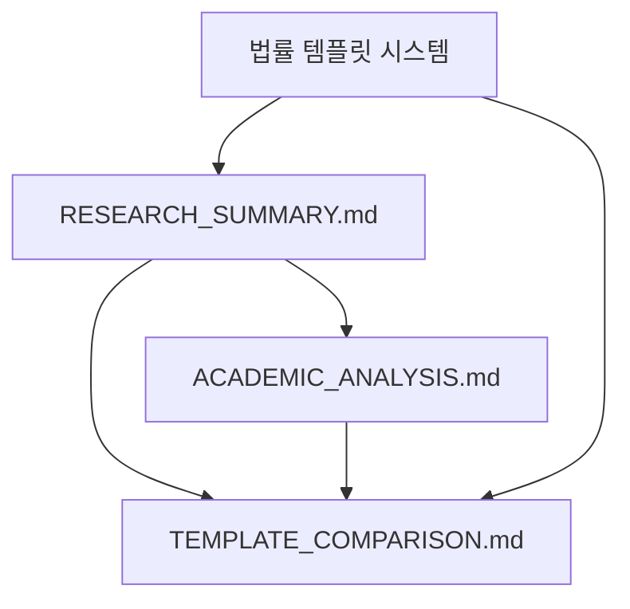

# 법률 에이전트 템플릿 사용 가이드

## 📁 파일 구조

```
system_prompts/
├── legal_agent_system_prompt.mustache  # 법률 에이전트 시스템 프롬프트

templates/
├── legal_query_template.mustache       # 법률 질의응답 템플릿 (상세 버전)
├── legal_query_template_simple.mustache # 법률 질의응답 템플릿 (간소 버전)
├── refine_markdown.mustache            # 마크다운 정제 템플릿
├── ACADEMIC_ANALYSIS.md               # 학술적 분석 보고서
├── TEMPLATE_COMPARISON.md             # 템플릿 버전별 상세 비교

├── RESEARCH_SUMMARY.md               # 연구 요약 및 핵심 지표
└── README.md                         # 이 파일
```

## 🎯 템플릿 변수 설명

### `legal_query_template.mustache` (상세 버전)

| 변수명 | 타입 | 설명 | 필수 |
|--------|------|------|------|
| `user_query` | string | 사용자의 질의문 | ✅ |
| `document_count` | number | 검색된 관련 문서 개수 | ✅ |
| `context_documents` | array | RAG로 검색된 관련 문서들 | ✅ |
| `query_timestamp` | string | 질의 시점 (ISO format) | ❌ |
| `current_datetime` | string | 처리 시점 (ISO format) | ❌ |
| `multiple_regulations` | boolean | 복수 법령 적용 여부 (조건부 섹션 제어) | ❌ |

### `legal_query_template_simple.mustache` (간소 버전)

간소 버전은 상세 버전과 동일한 변수를 사용하지만, 더 단순한 구조로 렌더링됩니다:

- **해석 방법론**: 16개 → 3개로 단순화
- **논증 단계**: 5단계 → 3단계로 축소  
- **조문 인용**: 완전 인용 → 핵심 요약
- **반박 논점**: 체계적 검토 → 미포함

**사용 권장 사항:**
- **상세 버전**: 법무팀, 복잡한 법리 해석, 전문가 대상
- **간소 버전**: 일반 사용자, 빠른 확인, 단순한 질의

### `context_documents` 배열 내 객체 구조

| 변수명 | 타입 | 설명 |
|--------|------|------|
| `source` | string | 문서 출처 경로 |
| `page_content` | string | 문서 본문 내용 |
| `category` | string | 문서 카테고리 (학사규정, 대학원규정 등) |
| `priority` | number | 문서 우선순위 (1-10) |
| `metadata.filename` | string | 원본 파일명 |
| `metadata.document_id` | string | 문서 고유 ID |
| `metadata.processed_at` | string | 문서 처리 시점 |
| `index` | number | 문서 순번 (선택적) |

## 🔧 사용 예시

### Python에서 mustache 사용

```python
import pystache
from datetime import datetime

# 템플릿 로드
with open('templates/legal_query_template.mustache', 'r', encoding='utf-8') as f:
    template = f.read()

# 데이터 준비
template_data = {
    'user_query': '박사과정 학생의 최대 수업연한은 얼마인가요?',
    'document_count': 2,
    'query_timestamp': datetime.now().isoformat(),
    'context_documents': [
        {
            'source': 'rules/graduate/대학원규정.pdf',
            'page_content': '박사과정 학생의 수업연한은 3년 이상으로 하되, 최대 6년을 초과할 수 없다.',
            'category': '대학원규정',
            'priority': 9,
            'metadata': {
                'filename': '대학원규정.pdf',
                'document_id': 'graduate_001',
                'processed_at': '2024-01-01T00:00:00'
            },
            'index': 1
        },
        {
            'source': 'rules/academic/학칙.pdf', 
            'page_content': '학위과정의 세부사항은 대학원규정에서 별도로 정한다.',
            'category': '학칙',
            'priority': 10,
            'metadata': {
                'filename': '학칙.pdf',
                'document_id': 'academic_001', 
                'processed_at': '2024-01-01T00:00:00'
            },
            'index': 2
        }
    ]
}

# 템플릿 렌더링
rendered = pystache.render(template, template_data)
print(rendered)
```

### JavaScript에서 mustache 사용

```javascript
const Mustache = require('mustache');
const fs = require('fs');

// 템플릿 로드
const template = fs.readFileSync('templates/legal_query_template.mustache', 'utf8');

// 데이터 준비
const templateData = {
    user_query: '박사과정 학생의 최대 수업연한은 얼마인가요?',
    document_count: 2,
    query_timestamp: new Date().toISOString(),
    context_documents: [
        {
            source: 'rules/graduate/대학원규정.pdf',
            page_content: '박사과정 학생의 수업연한은 3년 이상으로 하되, 최대 6년을 초과할 수 없다.',
            category: '대학원규정',
            priority: 9,
            metadata: {
                filename: '대학원규정.pdf',
                document_id: 'graduate_001',
                processed_at: '2024-01-01T00:00:00'
            },
            index: 1
        }
    ]
};

// 템플릿 렌더링
const rendered = Mustache.render(template, templateData);
console.log(rendered);
```

## 📋 통합 가이드

### 1. RAG 시스템과 통합

```python
def create_legal_prompt(user_query, retrieved_docs):
    """RAG 결과를 법률 템플릿에 적용"""
    
    # 문서들을 템플릿 형식으로 변환
    context_documents = []
    for idx, doc in enumerate(retrieved_docs, 1):
        context_documents.append({
            'source': doc.metadata.get('source', ''),
            'page_content': doc.page_content,
            'category': doc.metadata.get('category', ''),
            'priority': doc.metadata.get('priority', 5),
            'metadata': doc.metadata,
            'index': idx
        })
    
    template_data = {
        'user_query': user_query,
        'document_count': len(retrieved_docs),
        'query_timestamp': datetime.now().isoformat(),
        'context_documents': context_documents
    }
    
    # 템플릿 렌더링
    with open('templates/legal_query_template.mustache', 'r', encoding='utf-8') as f:
        template = f.read()
    
    return pystache.render(template, template_data)
```

### 2. LLM과 통합

```python
import litellm

def get_legal_response(user_query, retrieved_docs):
    """법률 에이전트로부터 답변 받기"""
    
    # 시스템 프롬프트 로드
    with open('system_prompts/legal_agent_system_prompt.mustache', 'r', encoding='utf-8') as f:
        system_prompt = f.read()
    
    # 사용자 프롬프트 생성
    user_prompt = create_legal_prompt(user_query, retrieved_docs)
    
    # LLM 호출
    response = litellm.completion(
        model="gpt-4",
        messages=[
            {"role": "system", "content": system_prompt},
            {"role": "user", "content": user_prompt}
        ],
        temperature=0.1,  # 법률 자문은 일관성이 중요
        max_tokens=2000
    )
    
    return response.choices[0].message.content
```

## 🎨 커스터마이징

### 템플릿 수정
- **문서 표시 형식** 변경: `{{#context_documents}}` 섹션 수정
- **추가 메타데이터** 포함: `metadata` 객체에 새 필드 추가  
- **출력 형식** 변경: 마크다운, HTML, 플레인 텍스트 등

### 시스템 프롬프트 조정
- **전문 분야** 특화: 특정 규정 영역에 집중
- **어조** 변경: 더 친근하거나 더 격식있게
- **추가 지침**: 특별한 상황이나 예외사항 처리

## 🔍 문제 해결

### 자주 발생하는 이슈

1. **문서가 표시되지 않음**
   - `context_documents` 배열이 비어있는지 확인
   - `page_content` 필드가 존재하는지 확인

2. **한글 인코딩 문제**
   - 파일을 `utf-8`로 읽기/쓰기 확인
   - 템플릿 데이터의 한글 문자열 인코딩 확인

3. **조건부 표시 문제**
   - mustache의 `{{#field}}` 문법 확인
   - `null`이나 `undefined` 값 처리

---

## 📊 학술적 분석 문서

템플릿 디렉토리에는 RAG 시스템의 적응적 복잡도 제어에 대한 학술적 연구 문서들이 포함되어 있습니다.

### 📚 분석 문서 개요

#### `RESEARCH_SUMMARY.md` - 연구 요약
- **목적**: 핵심 연구 가설 및 예상 결과 요약
- **대상**: 연구자, 의사결정자, 빠른 이해가 필요한 독자
- **내용**: 핵심 지표, 이론적 기반, 실험 설계, 기대 효과

#### `ACADEMIC_ANALYSIS.md` - 상세 학술 분석  
- **목적**: 포괄적 이론적 배경 및 방법론 제시
- **대상**: 학술 연구자, 논문 작성자, 심층 분석 필요자
- **내용**: 인지과학적 근거, 법학교육학적 원리, 실험 설계, 기대 기여도

#### `TEMPLATE_COMPARISON.md` - 템플릿 상세 비교
- **목적**: 두 버전 간의 구체적 차이점 정량적 분석  
- **대상**: 시스템 설계자, 개발자, 기술 연구자
- **내용**: 구조적 복잡도, 기능적 차이, UX 차이, 실험 설계


### 🎯 활용 방법

#### 연구 목적별 추천 문서

```
📖 학술 논문 작성 시:
   RESEARCH_SUMMARY.md → ACADEMIC_ANALYSIS.md → TEMPLATE_COMPARISON.md

📊 실험 설계 시:
   ACADEMIC_ANALYSIS.md → TEMPLATE_COMPARISON.md → RESEARCH_SUMMARY.md

📈 성과 평가 및 분석 시:
   TEMPLATE_COMPARISON.md → ACADEMIC_ANALYSIS.md → RESEARCH_SUMMARY.md
```

#### 주요 연구 질문과 해당 문서

| 연구 질문 | 주요 참조 문서 | 핵심 섹션 |
|-----------|----------------|-----------|
| "사용자 전문성이 RAG 성능에 미치는 영향은?" | ACADEMIC_ANALYSIS.md | 인지과학적 근거 |  
| "복잡도 차별화의 정량적 효과는?" | TEMPLATE_COMPARISON.md | 정량적 비교 지표 |
| "실험은 어떻게 설계해야 하나?" | ACADEMIC_ANALYSIS.md | 실험적 검증 가능성 |
| "기대되는 학술적 기여는?" | RESEARCH_SUMMARY.md | 핵심 기여도 |
| "두 템플릿의 구체적 차이는?" | TEMPLATE_COMPARISON.md | 기능적 차이 분석 |

### 🔗 문서 간 연관성



**설명**:
- **RESEARCH_SUMMARY**: 모든 문서의 **진입점** 역할, 핵심 가설과 결과 요약
- **ACADEMIC_ANALYSIS**: **이론적 깊이** 제공, 인지과학적 근거와 실험 설계
- **TEMPLATE_COMPARISON**: **정량적 근거** 제시, 구체적 차이점과 사용성 분석

---

## 📞 지원

### 일반 사용
템플릿 사용 중 문제가 있거나 개선사항이 있다면:
1. 이슈 트래커에 버그 리포트 등록
2. 커스텀 템플릿 공유
3. 개선 제안 제출

### 학술 연구
연구 관련 문의나 협력 제안:
1. **데이터 공유**: 실험 데이터셋 및 결과 공유 가능
2. **공동 연구**: 후속 연구나 확장 연구 협력  
3. **기술 자문**: 구현 관련 기술적 자문 및 멘토링
